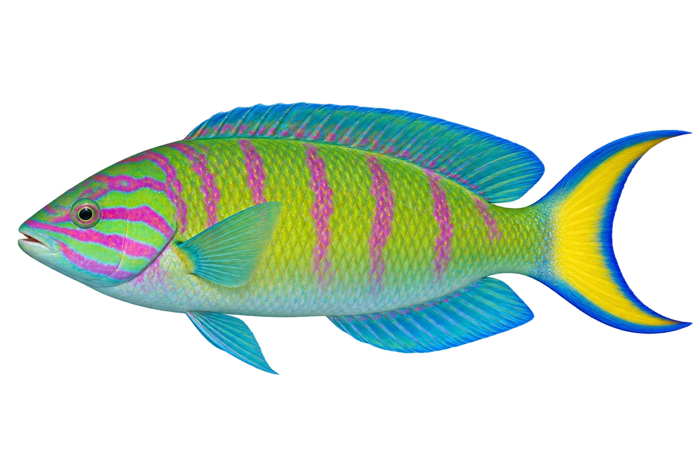

# 月尾隆头鱼

Thalassoma lunare · 鱼 · 2026-10-07

选择成鱼阶段，幼鱼不同。

- **绿底红线**：它的绿色身体上有红色线条。（VTH-AH-01）
- **尾巴会变化**：幼鱼尾巴较平，成鱼尾巴像弯弯的月牙。（VTH-AH-02）
- **暖海礁区**：它生活在热带印度洋和太平洋的礁区。（VTH-AH-03）

资料：[Australian Museum](https://australian.museum/learn/animals/fishes/moon-wrasse-thalassoma-lunare/)。位置：Identification / Summary / Biology / Habitat / species account。

[事实表](../claims.json) · [配音脚本](../scripts/audio-v1.json) · [生成提示与原图索引](../../../design/content/v1/generation.json)

每卡一段介绍、三个点听。新卡没有设置未经标定的局部放大坐标。图为 AI 原创艺术示意，非鉴定照片；交付为 2D 插画及图鉴内容，不代表新增三维捕获物种。
