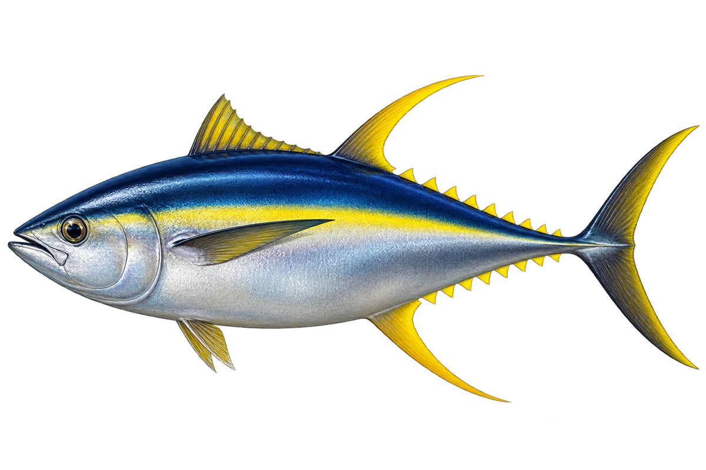

# 黄鳍金枪鱼 · 内容包 v1

2026-10-06 · Thunnus albacares · 主要制作：主代理亲自完成。

## 观察与自由创作

孩子入口：看黄鳍金枪鱼，它的鳍是黄色的。

画一些小小的鳍，或者给大鳍换你喜欢的颜色。

| 点听 | 短句 | 事实依据 |
| --- | --- | --- |
| 像一枚鱼雷 | 身体两头细，中间粗。 | TA-01 |
| 黄色的鳍 | 背鳍、臀鳍和后面的小鳍，是黄色的。 | TA-02 |
| 蓝背与银肚 | 背上深蓝，肚子银亮亮。 | TA-03 |

不是答题关卡。创作不要求与真实鱼一致；不同嘴、鳍、身体和花纹可以自由组合。

## 亲子解释与证据范围

本卡对应 T. albacares，采用长黄鳍成鱼近似图。NOAA 该页关注大西洋种群，不将其管理规则泛化为全球；图片体形不证明速度纪录。

本页事实引用 [claims.json](../claims.json)：TA-01、TA-02、TA-03。

- [NOAA Fisheries：Atlantic Yellowfin Tuna](https://www.fisheries.noaa.gov/species/atlantic-yellowfin-tuna)

中文短名是孩子入口称呼，正式中文名为项目称呼或工作名；以学名明确对象，未统一认证所有地区俗名。艺术图不是照片，也不是精细分类检索图。

## 已制作素材

- [PNG 原始插画](../../../design/content/v1/illustrations/thunnus-albacares.png)
- [WebP 透明展示图](../../../public/content/v1/illustrations/thunnus-albacares.webp)
- [短介绍音频](../../../public/content/v1/audio/vo-ta-intro.wav)；另有 3 段点听音频，见 [脚本登记](../scripts/audio-v1.json)。
- [互动预览](../../../public/content/v1/index.html) 包含局部编号、重听、停止和亲子来源展开。

成品用于素材评审和接入准备。声音为系统合成试听，正式分发的声音授权单列；鱼的真实泳姿、精细三维结构和原目录全部历史行为仍不因插画完成而自动认证。
