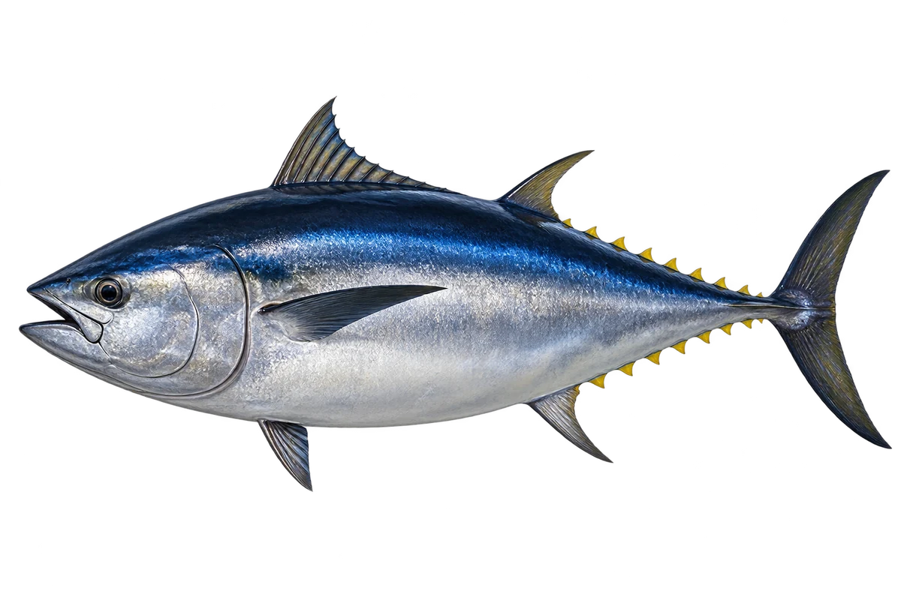

# 大西洋蓝鳍金枪鱼

Thunnus thynnus · 鱼 · 2026-10-07

以明确物种代表常用名称；插画是观察示意，不用来野外鉴定。

- **梭子一样**：它身体粗壮而流线形，背部深蓝，肚子较白。（VTH-BE-01）
- **短短的胸鳍**：大西洋蓝鳍金枪鱼的胸鳍，比一些金枪鱼短。（VTH-BE-02）
- **吃鱼的猎手**：成鱼主要吃鲱鱼、鲭鱼等小型鱼。（VTH-BE-03）

资料：[NOAA Fisheries](https://www.fisheries.noaa.gov/species/western-atlantic-bluefin-tuna)。位置：Identification / Summary / Biology / Habitat / species account。

[事实表](../claims.json) · [配音脚本](../scripts/audio-v1.json) · [生成提示与原图索引](../../../design/content/v1/generation.json)

每卡一段介绍、三个点听。新卡没有设置未经标定的局部放大坐标。图为 AI 原创艺术示意，非鉴定照片；交付为 2D 插画及图鉴内容，不代表新增三维捕获物种。
