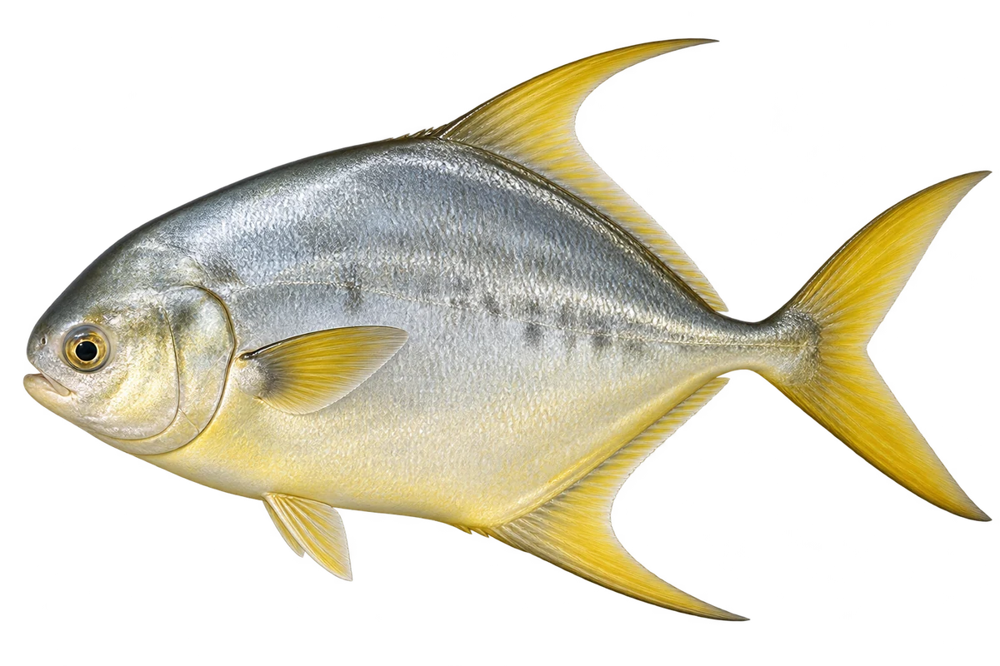

# 金鲳（卵形鲳鲹）

Trachinotus blochii · 鱼 · 2026-10-07

以明确物种代表常用名称；插画是观察示意，不用来野外鉴定。

- **圆钝的鼻子**：它身体较高，鼻子圆圆的，成鱼可以带金橙色。（VTH-BA-01）
- **海岸和礁边**：它常在靠近礁区的浅海活动。（VTH-BA-02）
- **吃硬壳小动物**：它会吃带硬壳的贝类和其他无脊椎动物。（VTH-BA-03）

资料：[Museums Victoria / Fishes of Australia](https://fishesofaustralia.net.au/home/species/2993)。位置：Identification / Summary / Biology / Habitat / species account。

[事实表](../claims.json) · [配音脚本](../scripts/audio-v1.json) · [生成提示与原图索引](../../../design/content/v1/generation.json)

每卡一段介绍、三个点听。新卡没有设置未经标定的局部放大坐标。图为 AI 原创艺术示意，非鉴定照片；交付为 2D 插画及图鉴内容，不代表新增三维捕获物种。
