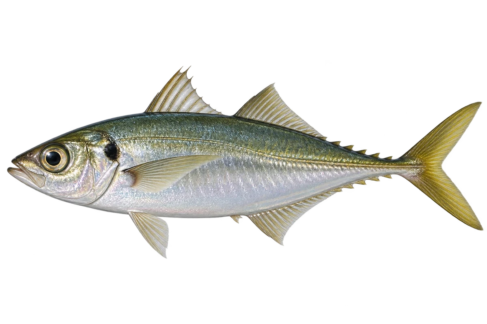

# 日本竹荚鱼

Trachurus japonicus · 鱼 · 2026-10-07

以明确物种代表常用名称；插画是观察示意，不用来野外鉴定。

- **硬硬的侧线鳞**：它身体侧面的线，排列着较高、较硬的鳞。（VTH-BL-01）
- **沿岸结伴游**：它们一般成群，在近岸水域活动。（VTH-BL-02）
- **吃小虾小鱼**：它主要吃小型甲壳动物和鱼。（VTH-BL-03）

资料：[中央研究院／臺灣魚類資料庫](https://fishdb.sinica.edu.tw/e_books/fishshell2011pic.php?id=289)。位置：Identification / Summary / Biology / Habitat / species account。

[事实表](../claims.json) · [配音脚本](../scripts/audio-v1.json) · [生成提示与原图索引](../../../design/content/v1/generation.json)

每卡一段介绍、三个点听。新卡没有设置未经标定的局部放大坐标。图为 AI 原创艺术示意，非鉴定照片；交付为 2D 插画及图鉴内容，不代表新增三维捕获物种。
