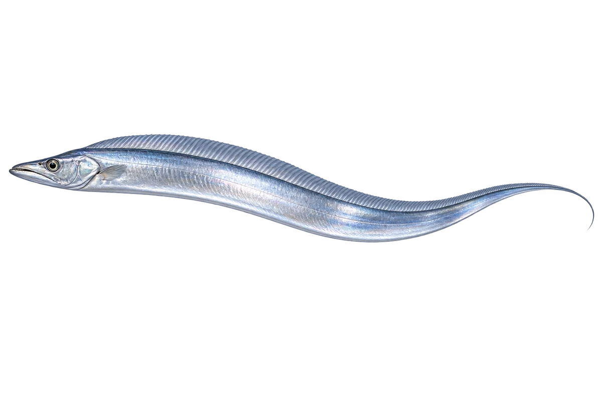

# 大头带鱼 · 内容包 v1

2026-10-06 · Trichiurus lepturus · 主要制作：主代理亲自完成。

## 观察与自由创作

孩子入口：看看带鱼，像一条银色的长带子。

画一条长长的鱼，末端可以尖尖的，也可以自由想象。

| 点听 | 短句 | 事实依据 |
| --- | --- | --- |
| 像一条带子 | 它的身体，又长又扁。 | TL-01 |
| 尖尖的末端 | 身体末端尖尖的，没有扇形尾鳍。 | TL-02 |
| 长长的背鳍 | 背上的鳍，沿着身体排得很长。 | TL-03 |

不是答题关卡。创作不要求与真实鱼一致；不同嘴、鳍、身体和花纹可以自由组合。

## 亲子解释与证据范围

限定 T. lepturus 示例；带鱼涉及相似物种复合群，不声称餐桌带鱼全为本种。闭口、完整活鱼示意；没有给它补上不存在的扇尾。

本页事实引用 [claims.json](../claims.json)：TL-01、TL-02、TL-03。

- [Museums Victoria / Fishes of Australia：Largehead Hairtail](https://fishesofaustralia.net.au/home/species/2562)

中文短名是孩子入口称呼，正式中文名为项目称呼或工作名；以学名明确对象，未统一认证所有地区俗名。艺术图不是照片，也不是精细分类检索图。

## 已制作素材

- [PNG 原始插画](../../../design/content/v1/illustrations/trichiurus-lepturus.png)
- [WebP 透明展示图](../../../public/content/v1/illustrations/trichiurus-lepturus.webp)
- [短介绍音频](../../../public/content/v1/audio/vo-tl-intro.wav)；另有 3 段点听音频，见 [脚本登记](../scripts/audio-v1.json)。
- [互动预览](../../../public/content/v1/index.html) 包含局部编号、重听、停止和亲子来源展开。

成品用于素材评审和接入准备。声音为系统合成试听，正式分发的声音授权单列；鱼的真实泳姿、精细三维结构和原目录全部历史行为仍不因插画完成而自动认证。
