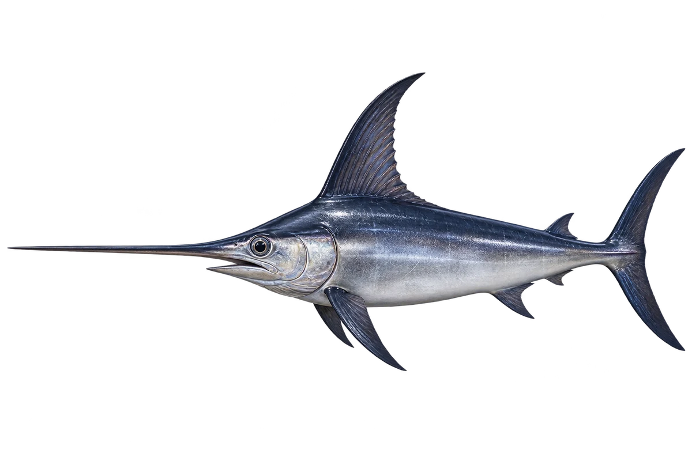

# 剑鱼

Xiphias gladius · 鱼 · 2026-10-07

以明确物种代表常用名称；插画是观察示意，不用来野外鉴定。

- **剑一样的长嘴**：它的上颌向前伸，长而扁，像一把剑。（VTH-BG-01）
- **弯弯的尾巴**：它的尾巴宽宽的，弯成月牙形。（VTH-BG-02）
- **上深下浅**：它身体上面颜色深，下面颜色较浅。（VTH-BG-03）

资料：[NOAA Fisheries](https://www.fisheries.noaa.gov/species/north-atlantic-swordfish)。位置：Identification / Summary / Biology / Habitat / species account。

[事实表](../claims.json) · [配音脚本](../scripts/audio-v1.json) · [生成提示与原图索引](../../../design/content/v1/generation.json)

每卡一段介绍、三个点听。新卡没有设置未经标定的局部放大坐标。图为 AI 原创艺术示意，非鉴定照片；交付为 2D 插画及图鉴内容，不代表新增三维捕获物种。
