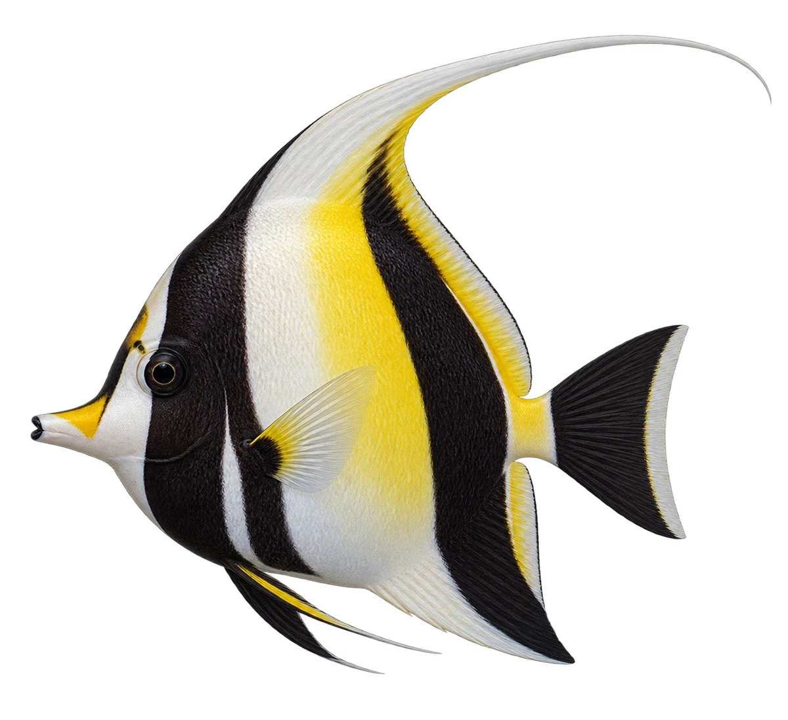

# 角镰鱼 · 内容包 v1

2026-10-06 · Zanclus cornutus · 主要制作：主代理亲自完成。

## 观察与自由创作

孩子入口：看看这条鱼，背鳍拖着长长的白丝。

画一条长鳍，或者画成好多短鳍，都可以。

| 点听 | 短句 | 事实依据 |
| --- | --- | --- |
| 长长的背鳍 | 背上的鳍，像一条长长的白丝。 | ZC-01 |
| 两条黑带 | 身体上有两条宽宽的黑带。 | ZC-02 |
| 嘴前的黄色 | 看看嘴巴前面，还有一块黄色。 | ZC-02 |

不是答题关卡。创作不要求与真实鱼一致；不同嘴、鳍、身体和花纹可以自由组合。

## 亲子解释与证据范围

长白丝是背鳍的一部分。成鱼眼前骨质突起仅在亲子事实里介绍，当前图不作为该微小结构的准确放大图。

本页事实引用 [claims.json](../claims.json)：ZC-01、ZC-02、ZC-03。

- [Australian Museum / Mark McGrouther：Moorish Idol](https://australian.museum/learn/animals/fishes/moorish-idol-zanclus-cornutus-linnaeus-1758/)

中文短名是孩子入口称呼，正式中文名为项目称呼或工作名；以学名明确对象，未统一认证所有地区俗名。艺术图不是照片，也不是精细分类检索图。

## 已制作素材

- [PNG 原始插画](../../../design/content/v1/illustrations/zanclus-cornutus.png)
- [WebP 透明展示图](../../../public/content/v1/illustrations/zanclus-cornutus.webp)
- [短介绍音频](../../../public/content/v1/audio/vo-zc-intro.wav)；另有 3 段点听音频，见 [脚本登记](../scripts/audio-v1.json)。
- [互动预览](../../../public/content/v1/index.html) 包含局部编号、重听、停止和亲子来源展开。

成品用于素材评审和接入准备。声音为系统合成试听，正式分发的声音授权单列；鱼的真实泳姿、精细三维结构和原目录全部历史行为仍不因插画完成而自动认证。
