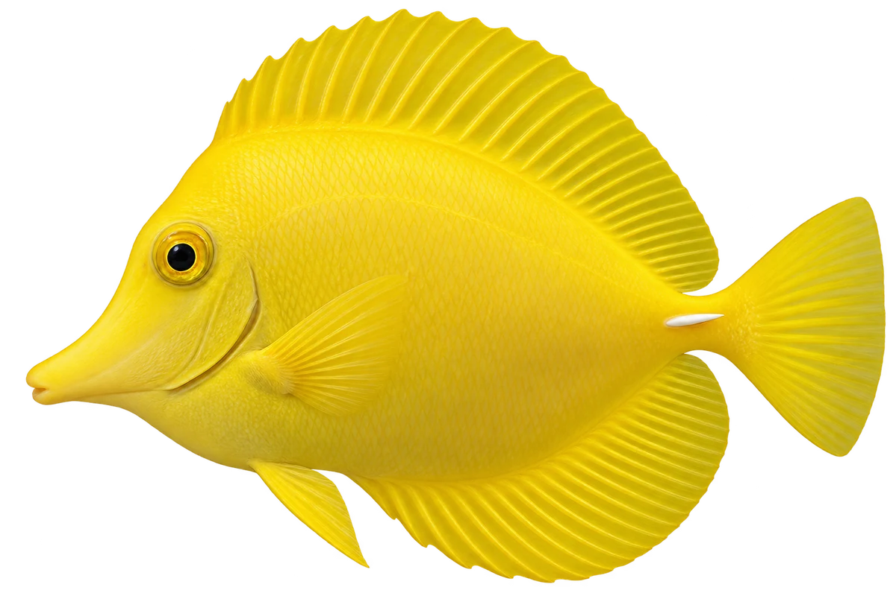

# 黄高鳍刺尾鱼 · 内容包 v1

2026-10-06 · Zebrasoma flavescens · 主要制作：主代理亲自完成。

## 观察与自由创作

孩子入口：这条鱼，白天常常是亮黄色的。

你的鱼在白天和晚上，要穿一样的颜色吗？

| 点听 | 短句 | 事实依据 |
| --- | --- | --- |
| 尾根的白刺 | 看看尾巴根部，这里有一根白色的小刺。 | ZF-01 |
| 吃藻类 | 它会啃食藻类。 | ZF-02 |
| 夜晚的颜色 | 到了晚上，黄色会变暗，身体中间会出现白带。 | ZF-03 |

不是答题关卡。创作不要求与真实鱼一致；不同嘴、鳍、身体和花纹可以自由组合。

## 亲子解释与证据范围

图画白天色型；夜间颜色与条带不能用当前静态图直接观察。它主要吃藻类，鱼饵权重属于游戏设定。

本页事实引用 [claims.json](../claims.json)：ZF-01、ZF-02、ZF-03。

- [Waikīkī Aquarium：Yellow Tang](https://www.waikikiaquarium.org/experience/animal-guide/fishes/surgeonfishes/yellow-tang/)

中文短名是孩子入口称呼，正式中文名为项目称呼或工作名；以学名明确对象，未统一认证所有地区俗名。艺术图不是照片，也不是精细分类检索图。

## 已制作素材

- [PNG 原始插画](../../../design/content/v1/illustrations/zebrasoma-flavescens.png)
- [WebP 透明展示图](../../../public/content/v1/illustrations/zebrasoma-flavescens.webp)
- [短介绍音频](../../../public/content/v1/audio/vo-zf-intro.wav)；另有 3 段点听音频，见 [脚本登记](../scripts/audio-v1.json)。
- [互动预览](../../../public/content/v1/index.html) 包含局部编号、重听、停止和亲子来源展开。

成品用于素材评审和接入准备。声音为系统合成试听，正式分发的声音授权单列；鱼的真实泳姿、精细三维结构和原目录全部历史行为仍不因插画完成而自动认证。
