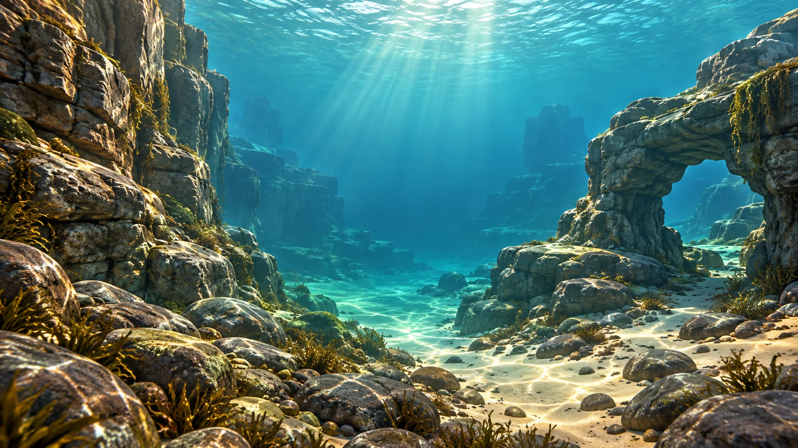

# 自己的海洋：岩礁海岸主题包

2026-10-06 · 原创环境成品，与珊瑚浅海组成两种明显不同的视觉主题。

## 场景身份

左侧为分层岩壁，右侧为石拱与大块岩石，底部是卵石和倾斜沙地。灰褐岩石配蓝绿色水，稀疏棕绿海藻围绕岩石底部，远处留宽通道。没有用珊瑚花园换颜色冒充第二个场景。

与 [珊瑚浅海](reef-shallows.md) 比较：前者以沙地和珊瑚礁体引导视线，本主题用岩壁、拱洞、卵石与藻丛建立空间。两者均给自己的鱼保留足够大、安静的可见水域。

## 内容与创作联系

当前岩礁素材的鱼为许氏平鲉、黑棘鲷、大泷六线鱼、条石鲷、斑鱾、褐菖鲉。单条鱼的栖所与生命周期知识见对应 [物种内容包](../species)；这张构图不证明六种鱼在某同一地点同时出现。

孩子可以观察不同身体、条带、灰色与亮色、斑点，并给自己的幻想鱼选择家园。画什么颜色、住哪种背景是创作选择，不额外模拟生存惩罚，也不强制把幻想鱼改成某种真实鱼。

## 文件与接入

- [WebP 展示图](../../../public/content/v1/environments/rock-panorama.webp)
- [原始 PNG](../../../design/content/v1/environments/rock-panorama.png)
- [生成提示与导出尺寸](../../../design/content/v1/generation.json)
- [互动预览](../../../public/content/v1/index.html)：切换两种主题，同时保留幻想鱼的手绘花纹。

这是静态环境素材。实际 3D 岩壁、镜头遮挡、水面拉鱼和 iPad 9 性能属于后续接入，不把本画面当成已完成的新三维关卡。
